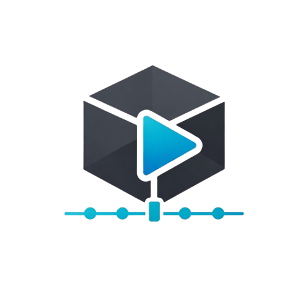

<p align="center">
  
</p>

## GLTF Model & Animation Preview

A lightweight 3D model viewer built with [Bevy](https://bevyengine.org/) for previewing GLTF/GLB models and their animations.

## Features

- Load GLTF/GLB models from anywhere on your system
- Orbit camera controls (rotate, pan, zoom)
- Animation playback with play/pause controls
- Animation list showing all available animations
- Draggable UI panel
- Real-time animation switching

## Requirements

- Rust 1.85+ (2024 edition)
- Cargo

## Installation

1. Clone the repository:

```bash
git clone https://github.com/Abdulkader-Safi/bevy_gltf_model_and_animation_preview.git
cd bevy_gltf_model_and_animation_preview
```

2. Build the project:

```bash
cargo build --release
```

## Usage

### Running the Application

```bash
cargo run --release
```

### Controls

| Action | Control |
|--------|---------|
| Open Model | Click "Open Model..." button |
| Rotate Camera | Left mouse drag |
| Pan Camera | Right mouse drag |
| Zoom | Scroll wheel |
| Select Animation | Click animation in list |
| Play/Pause | Click Play/Pause button |
| Move Panel | Drag the title bar |

### Loading a Model

1. Click the "Open Model..." button
2. Navigate to your GLTF or GLB file
3. Select the file and click Open
4. The model will appear in the center of the viewport

### Playing Animations

Once a model with animations is loaded:

1. The animation list will populate with all available animations
2. Click on any animation name to select and play it
3. Use the Play/Pause button to control playback
4. The currently selected animation is highlighted in the list

## Project Structure

```
src/
├── main.rs              # App entry point and plugin setup
├── components/
│   └── mod.rs           # UI and entity marker components
├── resources/
│   ├── mod.rs           # Module exports
│   ├── model_viewer.rs  # Model state and animation data
│   └── panel_drag_state.rs  # Panel dragging state
├── systems/
│   ├── mod.rs           # Module exports
│   ├── animation.rs     # Animation setup and playback control
│   ├── camera.rs        # Camera UI interaction handling
│   ├── model.rs         # GLTF model loading
│   └── panel.rs         # Panel dragging and scroll
└── ui/
    ├── mod.rs           # Module exports
    ├── layout.rs        # Scene setup (camera, lights, UI)
    ├── interactions.rs  # Button and list click handlers
    └── update.rs        # UI label and list updates
```

## Dependencies

| Crate | Version | Purpose |
|-------|---------|---------|
| bevy | 0.17.3 | Game engine |
| bevy_file_dialog | 0.9 | Native file dialogs |
| bevy_panorbit_camera | 0.33 | Orbit camera controls |

## Building for Release

```bash
cargo build --release
```

The binary will be located at `target/release/bevy_gltf_model_and_animation_preview`.

## Supported File Formats

- `.gltf` - GLTF text format (with external resources)
- `.glb` - GLTF binary format (self-contained)

## Troubleshooting

### Model not appearing

- Ensure the file path contains no special characters
- Check that the GLTF file has at least one scene
- The model may be very small or large - try zooming in/out

### Animations not showing

- Not all GLTF files contain animations
- Check that your model has embedded animations (NLA tracks in Blender)
- The animation list shows "No animations" if none are found

### Camera not responding

- The camera is disabled when hovering over the UI panel
- Move your cursor away from the panel to control the camera

## License

MIT License - See [LICENSE](LICENSE) for details.

## Acknowledgments

- [Bevy Engine](https://bevyengine.org/) - A refreshingly simple data-driven game engine
- [bevy_panorbit_camera](https://github.com/Plonq/bevy_panorbit_camera) - Orbit camera plugin
- [bevy_file_dialog](https://github.com/richardhozak/bevy_file_dialog) - File dialog plugin
